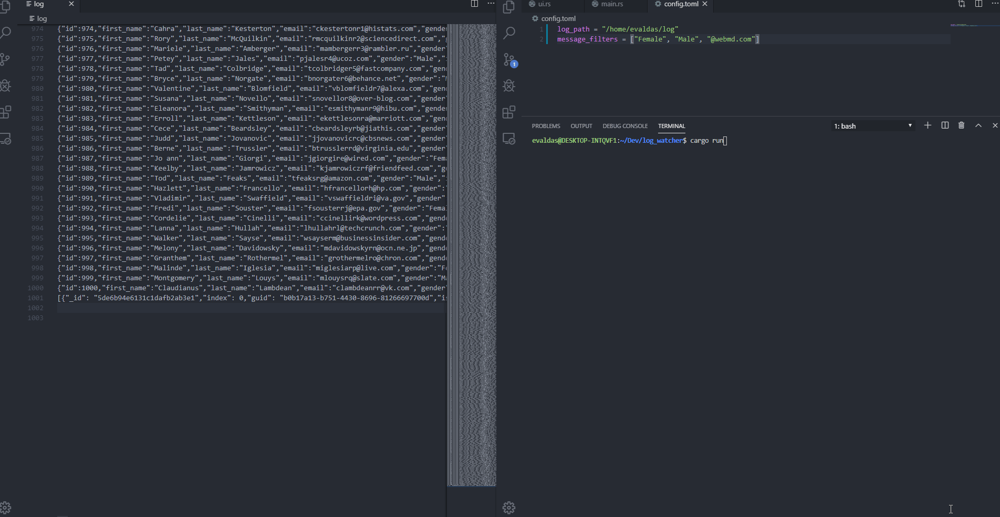

# log_watcher

Small terminal application used for watching your log files in real time

Features:
- Parse and display log entries in real time
- Apply user-defined filters and aggregate entries matching the filter into tabs
- Search function
- Inspection window
- JSON formatting if a line is detected as valid JSON format
- Scrolling
- Coloring based on user defined filters
- Bad optimization (I'll get to it one day)

